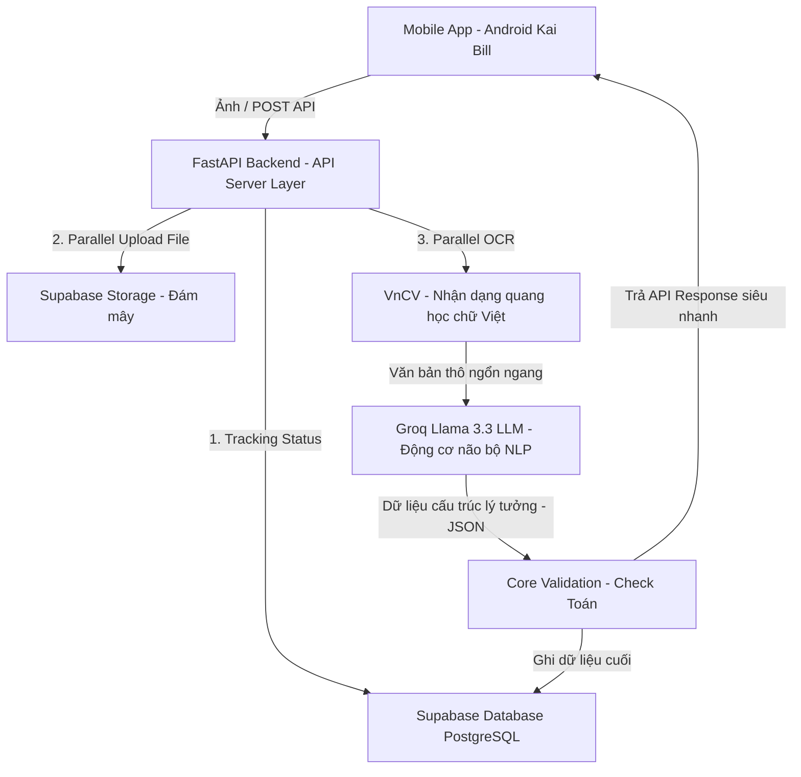
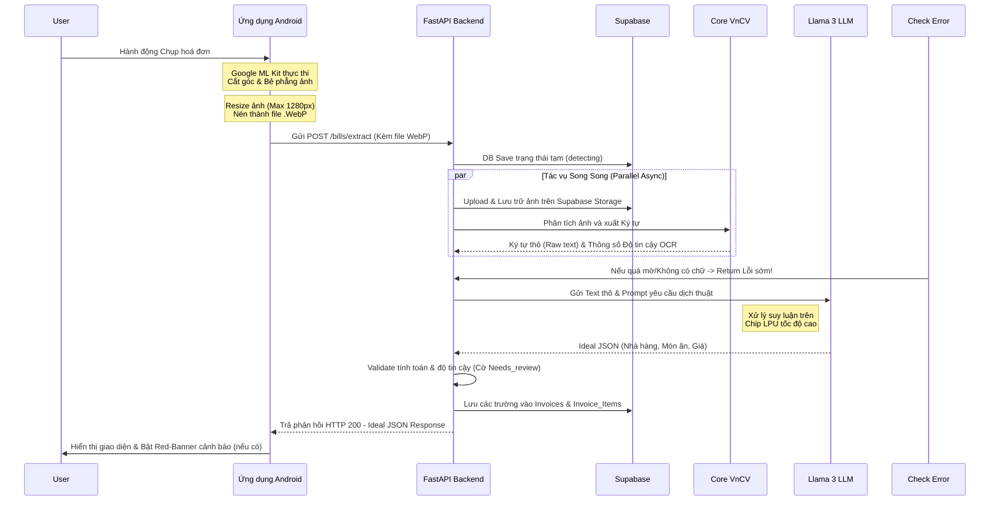

# ĐỀ CƯƠNG BÁO CÁO DỰ ÁN: KAI BILL
*(Trợ lý Tài chính Cá nhân Tích hợp Trí tuệ Nhân tạo AI)*

> **Lưu ý:** Đây là bộ sườn (outline) cực kì chi tiết được chuẩn hóa riêng cho đề tài "Bill AI - Kai Bill". Bạn copy trực tiếp cấu trúc này sang Microsoft Word và làm đầy chữ cho các tiểu mục là sẽ thành một cuốn khóa luận/Báo cáo bài bản!

---

## MỤC LỤC
1. CHƯƠNG 1: MỞ ĐẦU
2. CHƯƠNG 2: TỔNG QUAN KIẾN TRÚC HỆ THỐNG BILL AI
3. CHƯƠNG 3: PHÂN TÍCH VÀ THIẾT KẾ MOBILE APP (CLIEN - FRONTEND)
4. CHƯƠNG 4: PHÂN TÍCH VÀ THIẾT KẾ BACKEND VÀ CƠ SỞ DỮ LIỆU
5. CHƯƠNG 5: KIẾN TRÚC ỐNG DẪN AI (AI PIPELINE) VÀ LUỒNG HOẠT ĐỘNG
6. CHƯƠNG 6: THỬ NGHIỆM, ĐÁNH GIÁ VÀ HƯỚNG DẪN TRIỂN KHAI
7. CHƯƠNG 7: KẾT LUẬN VÀ HƯỚNG PHÁT TRIỂN TIẾP THEO

---

## CHƯƠNG 1: MỞ ĐẦU
**1.1. Lý do chọn đề tài**
* Nhu cầu thiết yếu về việc quản lý chi tiêu cá nhân trong cuộc sống hiện đại.
* Sự bất tiện, tốn thời gian và dễ sai sót khi người dùng phải nhập liệu hóa đơn (nhập tay) mỗi ngày.
* Sự bùng nổ của AI (Cụ thể là các mô hình LLMs lớn và OCR) đem lại khả năng giải quyết triệt để vấn đề này.

**1.2. Mục tiêu dự án**
* Xây dựng một ứng dụng mobile hoàn chỉnh giúp người dùng chỉ cần "Chụp là có dữ liệu".
* Tự động hóa quá trình nhận diện chữ (OCR) trên môi trường hóa đơn Việt Nam phức tạp.
* Ứng dụng AI suy luận thông minh để bóc tách thông tin thô thành dữ liệu có cấu trúc.

**1.3. Đối tượng và phạm vi ứng dụng**
* **Đối tượng:** Sinh viên, nhân viên văn phòng, các gia đình cần quản lý chi tiêu.
* **Phạm vi hóa đơn:** Hóa đơn siêu thị, biên lai chuyển khoản, hóa đơn nhà hàng quán cafe, biên lai điện nước...

**1.4. Tổng quan các công nghệ sử dụng**
* **Mobile Frontend:** Lập trình Android thuần chuyên nghiệp (Ngôn ngữ Java/Kotlin), Google ML Kit Object Scanner.
* **Backend:** Python với framework FastAPI.
* **Mô hình AI:** VnCV (Xử lý OCR văn bản Việt Nam dạng Offline), Groq Llama 3.3 70B (Suy luận logic NLP ngôn ngữ tự nhiên thành JSON).
* **Quản trị cơ sở dữ liệu:** Hệ sinh thái Supabase (PostgreSQL, Supabase Storage lớn và khả năng Auth).

---

## CHƯƠNG 2: TỔNG QUAN KIẾN TRÚC HỆ THỐNG BILL AI
**2.1. Mô hình tổng thể (Client - Server)**
* Giải thích khái niệm chia tách rõ ràng giữa Mobile chịu trách nhiệm giao diện, tính năng chụp ảnh và Server chịu trách nhiệm xử lý tải lớn với trí tuệ nhân tạo.

**2.2. Các thành phần chính trong hệ thống**
* **2.2.1. Front-end: Ứng dụng Android (Kai Bill)**: Thiết bị đầu cuối, chuyên thu thập ảnh chụp và tương tác người dùng.
* **2.2.2. Back-end: API Server (FastAPI)**: Trung tâm điều phối, tiếp nhận ảnh từ điện thoại, thực hiện kiểm tra bảo mật, điều phối các cụm máy học.
* **2.2.3. AI Engine: Cụm OCR và LLM**: Mô tả cụm phân tích (tách biệt OCR chuyên đọc chữ, và LLM chuyên hiểu nghĩa).
* **2.2.4. Lưu trữ (Supabase Platform)**: Lưu trữ ảnh vật lý (Storage) và lưu trữ dữ liệu siêu Metadata (PostgreSQL).

**2.3. Lưu đồ kiến trúc hệ thống tổng quát**
*(Sử dụng sơ đồ dưới đây để đưa vào báo cáo Word)*

---

## CHƯƠNG 3: PHÂN TÍCH VÀ THIẾT KẾ MOBILE APP (CLIENT)
**3.1. Phân tích yêu cầu chức năng (Use-case)**
* Chụp ảnh hóa đơn, Xem chi tiết hóa đơn, Sửa hóa đơn (nếu AI dán nhãn sai/hoặc báo mờ), Xem lịch sử chi tiêu.

**3.2. Thiết kế Giao diện người dùng (UI/UX)**
* **3.2.1. Màn hình quét hóa đơn**: Cơ chế sử dụng thư viện Google ML Kit để bo góc tự động tờ hóa đơn và bẻ phẳng góc chụp.
* **3.2.2. Màn hình chi tiết hóa đơn**: Cơ chế Dynamic UI - Giao diện tự co giãn.
* **3.2.3. Màn hình Thống kê**

**3.3. Tối ưu hóa hiệu suất tại Client-Side (Cực kỳ quan trọng)**
* Hàng nghìn người dùng sử dụng cùng lúc sẽ làm sập mạng, do đó Mobile phải xử lý Tiền xử lý.
* **3.3.1. Kỹ thuật Resize và Nén**: Giới hạn Max Side 1280px và nén định dạng WebP (giúp giảm 70% dung lượng mạng).
* **3.3.2. Kích thước file tối ưu**: Chuyển GrayScale nhằm mục tiêu dung lượng ảnh gửi đi cực nhẹ (< 500KB).

**3.4. Điểm sáng kiến trúc: Mobile API Contract**
* **3.4.1. Cơ cấu JSON Lý tưởng (Ideal response)**: Cách Mobile hứng bất kỳ hóa đơn nào cũng ra 1 form (Store, Total, Items...).
* **3.4.2. Kháng thay đổi (Resilience UI)**: Không code cứng (hardcode) TextView, dùng RecyclerView duyệt qua object data để ứng dụng không bị Crash.
* **3.4.3. Cảnh báo thông minh (Needs_Review Banner)**: Cách hiển thị Red-Banner nếu biến `needs_review` từ API trả về True.

---

## CHƯƠNG 4: PHÂN TÍCH VÀ THIẾT KẾ BACKEND VÀ CƠ SỞ DỮ LIỆU
**4.1. Cấu trúc Project Backend (Kiến trúc Micro-module)**
* Bóc tách các layer: `root`, `/api/` (Routers, Middleware), `/core/` (Nghiệp vụ, Pipeline, Database, LLMs).

**4.2. Thiết kế API Endpoints RESTful**
* Giao thức xác thực: Headers `X-API-Key`
* Mô tả Endpoint mạnh nhất: `POST /bills/extract` (Chạy luồng phức hợp dưới 15 giây).
* Các Endpoints bổ trợ: Tải lịch sử, Xóa, Export ra file CSV.

**4.3. Phân tích Database Schema (PostgreSQL)**
* **4.3.1. Bảng `invoices`**: Lưu thông tin gốc (tên quán, ngày giờ, số tiền tổng).
* **4.3.2. Bảng `invoice_items`**: Mối quan hệ 1-Nhiều. Quản lý chi tiết từng món đồ mua.
* **4.3.3. View tính toán (View Tối ưu Lịch sử)**: Tăng tốc Load ở App khi người dùng có hàng chục nghìn lịch sử chi tiêu bằng `v_invoice_summary`.

**4.4. Hệ thống Quản trị File Vật lý (Storage)**
* Phân luồng: Lưu ảnh gốc có chữ ký tự động ở thư mục `Original/YYYY/MM/DD/`.

---

## CHƯƠNG 5: KIẾN TRÚC ỐNG DẪN AI (AI PIPELINE) VÀ LUỒNG HOẠT ĐỘNG
*Đây là chương "khoe" trí tuệ của dự án. Trái tim nằm cả ở Chương này.*

**5.1. Công nghệ nhận dạng ký tự quang học (OCR) - VnCV**
* Lý do không dùng Tesseract: Vì độ phức tạp tiếng Việt.
* Chạy Warm-Up Model: Tải model sẵn vào RAM Server ngay khi bật máy để ảnh bắn lên là đọc, không độ trễ.

**5.2. Công nghệ Cấu trúc Dữ liệu - Large Language Model (Groq Llama 3)**
* **5.2.1. Nghệ thuật Prompt Engineering**: Mớm lời nhắc cho Llama hiểu nó là chuyên gia đọc hóa đơn và bắt ép trả về format JSON strict.
* **5.2.2. Kiểm tra tính toàn vẹn Số học (Toán học trong hóa đơn)**: Llama bắt lỗi khi: Đơn giá nhân số lượng khác giá tổng, hoặc tổng các món con không bằng Tổng hóa đơn. Nếu có lỗi cờ `needs_review` được bật lên để báo sự bất minh minh toán học.

**5.3. Xử lý Bất đồng bộ (Parallel Async Processing)**
* Xử lý đa luồng (Thực thi lưu ảnh lên đám mây VÀ Nhận diện chữ cùng một lúc để ép tốc độ trả về < 10ms-15ms).

**5.4. Lưu đồ Sequence (Trình tự hoạt động chi tiết)**
*(Sử dụng sơ đồ dưới để gắn vào mục luồng hoạt động)*

---

## CHƯƠNG 6: THỬ NGHIỆM, ĐÁNH GIÁ VÀ HƯỚNG DẪN TRIỂN KHAI
**6.1. Hướng dẫn thiết lập (Setup & Deploy)**
* Yêu cầu môi trường (Python 3.x, Uvicorn, Supabase Account, Groq API Key).
* Các bước clone source, install requirements, run lệnh Uvicorn.
* Cách thiết lập bảng bằng Supabase Query `final.sql`.

**6.2. Các kịch bản và kết quả thử nghiệm (Test Cases)**
* **Kịch bản 1:** Hóa đơn siêu thị cực dài (Kiểm tra tốc độ Llama nhặt từng item).
* **Kịch bản 2:** Hóa đơn bị nhàu nát / Chụp xiên góc (Đánh giá khả năng của thuật toán bẻ phẳng trên Mobile và khả năng rà lỗi ở Backend).
* **Kịch bản 3:** Hóa đơn bị tính sai tiền bởi thu ngân (Nhằm xem thuật toán kiểm tra Toán Học của Backend bắt lỗi chuẩn xác ra sao để tung cờ Needs_Review).

**6.3. Đánh giá tính tối ưu**
* Kích thước ảnh trước vs sau khi tối ưu WebP tại Mobile Client.
* Tốc độ xử lý của từng Phase trong Backend (Dựa trên Log System ở Terminal).

---

## CHƯƠNG 7: KẾT LUẬN VÀ HƯỚNG PHÁT TRIỂN
**7.1. Kết quả đạt được**
* Hoàn thiện 1 app thực tế trơn tru, áp dụng rất sâu thuật toán về OCR và cả sức mạnh của Model Text Generation mới nhất (Llama 3.3).
* Giải quyết thành công rào cản tốc độ bằng thiết kế Async và song song.

**7.2. Tồn tại và khó khăn**
* Những khó khăn khi đọc chữ viết tay, hay hóa đơn bị thấm ướt quá nhiều. 
* Lỗi ảo giác (Hallucinations) do mô hình Llama sinh ra (hiếm gặp nhưng vẫn có tỷ lệ xác suất xảy ra).

**7.3. Hướng nghiên cứu tiếp theo**
* Tự động hóa kết nối với App Ngân hàng qua SMS OTP để đối chiếu giao dịch.
* Xây dựng hệ thống Biểu đồ Chart mạnh mẽ ở App để xem báo cáo (Thu-Chi định kỳ).
* Thêm chức năng Voice (Nói: Chi tiêu hủ tiếu 30k) nếu không có phần hóa đơn giấy.
